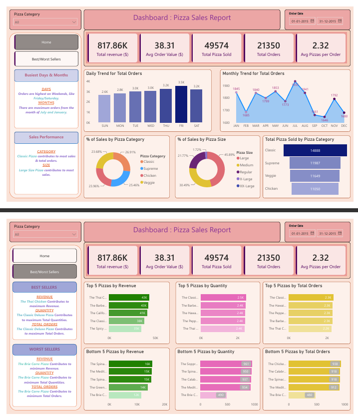

# 🍕 Pizza Sales Analysis Dashboard

<p align="center">
  
</p>

<p align="center">
  
  
  
</p>

---

# 📖 Project Overview

The **Pizza Sales Analysis Dashboard** is an end-to-end Business Intelligence project developed using **MySQL** and **Power BI**. The project analyzes pizza sales transactions to uncover valuable business insights, monitor sales performance, identify customer purchasing patterns, and evaluate the best and worst-selling pizzas.

The dashboard enables stakeholders to make data-driven decisions by presenting key performance indicators (KPIs), sales trends, category-wise analysis, and product performance in a single interactive dashboard.

---

# 🎯 Objectives

- Analyze overall sales performance.
- Monitor daily and monthly sales trends.
- Identify best and worst-selling pizzas.
- Compare sales across pizza categories and sizes.
- Measure important business KPIs.
- Support data-driven business decisions.

---

# 🛠️ Technologies Used

- **MySQL** – Data Analysis & SQL Queries
- **Power BI** – Dashboard Development
- **Microsoft Excel** – Data Cleaning
- **SQL** – KPI & Visualization Queries

---

# 📂 Dataset

The dataset contains transactional pizza sales information including:

- Order ID
- Order Date
- Pizza Name
- Pizza Category
- Pizza Size
- Quantity
- Unit Price
- Total Price

---

# 📊 Dashboard Features

### 📌 KPIs

- 💰 Total Revenue
- 🛒 Total Orders
- 🍕 Total Pizzas Sold
- 💵 Average Order Value
- 📦 Average Pizzas per Order

### 📈 Sales Analysis

- Daily Trend for Total Orders
- Monthly Trend for Total Orders
- Sales by Pizza Category
- Sales by Pizza Size

### 🏆 Best & Worst Sellers

- Top 5 Pizzas by Revenue
- Bottom 5 Pizzas by Revenue
- Top 5 Pizzas by Quantity
- Bottom 5 Pizzas by Quantity
- Top 5 Pizzas by Total Orders
- Bottom 5 Pizzas by Total Orders

---

# 📌 Key Business Insights

- Generated a total revenue of **$817.86K**.
- Processed **21,350 customer orders**.
- Sold **49,574 pizzas** during the analysis period.
- Average Order Value was **$38.31**.
- Average Pizzas per Order was **2.32**.
- **Classic Pizza** category generated the highest sales.
- **Large-size pizzas** contributed the highest revenue.
- **Thai Chicken Pizza** generated the maximum revenue.
- **Classic Deluxe Pizza** was the best-selling pizza by quantity and orders.
- **Brie Carre Pizza** recorded the lowest sales performance.

---

# 📁 Project Structure

```text
Pizza-Sales-Analysis/
│
├── Dataset/
│   └── pizza_sales.csv
│
├── SQL/
│   └── sql_queries_pizza_Sales.sql
│
├── Dashboard/
│   └── Pizza Sales Dashboard.pbix
│
├── images/
│   └── Pizza_sales_Dashboard.png
│
├── README.md
```

---

# 🚀 How to Run

1. Import the dataset into MySQL.
2. Execute the SQL queries.
3. Connect Power BI to MySQL.
4. Build the dashboard in Power BI.
5. Refresh the dashboard whenever new data is available.

---

# 📈 Dashboard Highlights

✔ Interactive KPI Cards

✔ Daily & Monthly Sales Trends

✔ Sales Distribution by Category & Size

✔ Top & Bottom Performing Pizzas

✔ Business Insights for Decision Making

---

# 👨‍💻 Author

**Rahul Garg**

If you found this project helpful, consider giving it a ⭐ on GitHub.